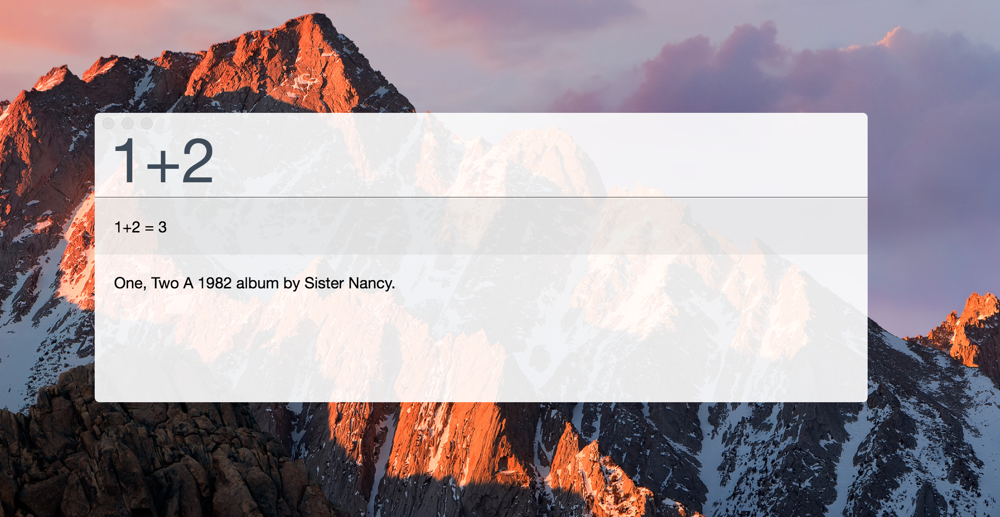
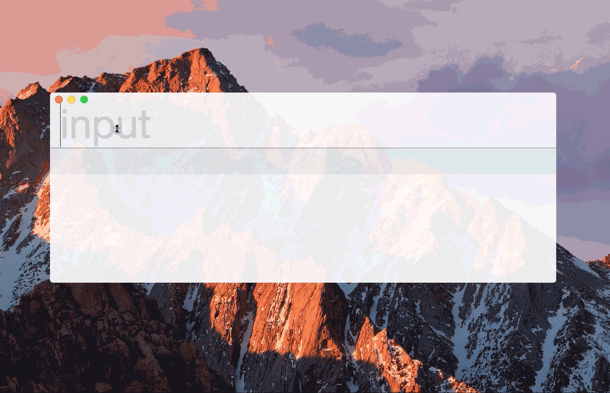

# cocoseis-bar
The aim of this project is to create a macOS extendable Spotlight alike application. New services can simply be created and installed.



## requirements
* **[Angular-Cli]**
* **typings** installed globally
* most likely **more** //TODO

## overview
The application consists of an input field and a view. The view contains all installed ```CService```s' previews. Each ```CService``` gets access to the input field and can determine on its own if it can serve a valid service with the input. Therefore each ```CService``` implements a ```changed``` method which gets triggered if the input has changed. Invalid ```CService```s become hidden. A preview can then be populated by its ```CService```.
On enter, the selected ```CService```'s ```changed``` method gets triggered in which the action for the ```CService``` can be defined.
To have only one ```CService``` selected a key can be specified.



## set up
```sh
$ npm install
```

## cbar-cli
With the **cbar-cli** ```CService```s can simply be created and installed. Build and run commands are included as well.
### generate a new ```CService```
Use ```generate``` or ```g``` to generate a new ```CService```

```sh
$ node ./scripts/cbar-cli.js generate myNewService
```

### install a ```CService```
Use ```install``` or ```i``` to install a ```CService```

```sh
$ node ./scripts/cbar-cli.js install myNewService
```

### build the angular
```sh
$ node ./scripts/cbar-cli.js build
```

### run in electron
```sh
$ node ./scripts/cbar-cli.js run
```

### build and run
```sh
$ node ./scripts/cbar-cli.js bnr
```

## quickstart
1. Make sure the requirements are met.
2. Run the setup: ```$ npm install ```
3. Build and run: ```$ node ./scripts/cbar-cli.js bnr ```


   [Angular-Cli]: <https://cli.angular.io>